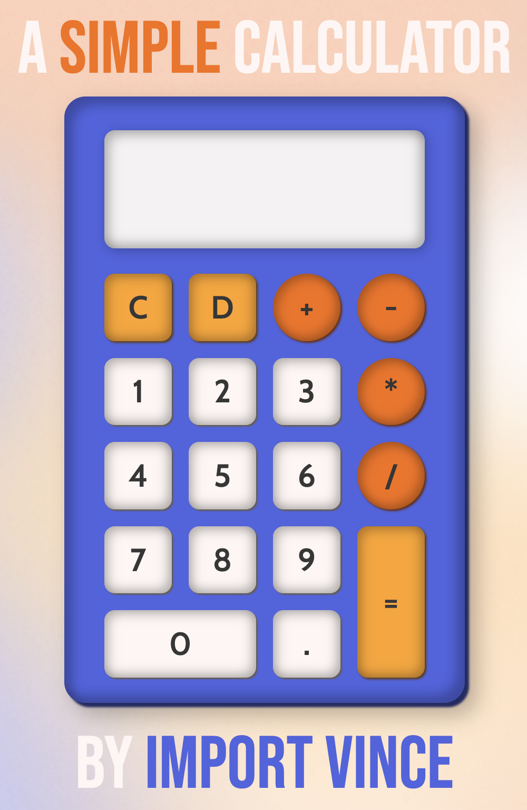
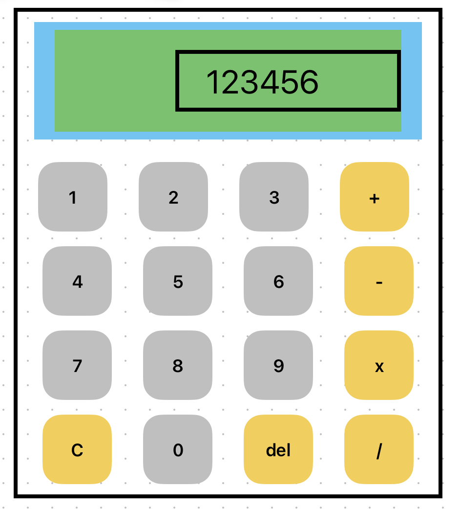

# calc

This is a solution to the [Calculator challenge from The Odin Project](https://www.theodinproject.com/lessons/foundations-calculator).

## Table of contents

- [Overview](#overview)
  - [The challenge](#the-challenge)
  - [Screenshot](#screenshot)
  - [Links](#links)
- [My process](#my-process)
  - [Built with](#built-with)
  - [What I learned](#what-i-learned)
  - [Continued development](#continued-development)

## Overview

### The challenge

Combine everything you've learned up until now to build a calculator that can add, subtract, multiply and divide. It should calculate two numbers at a time and allow for floating point inputs and solutions. 

### Screenshot

Here's the desktop view

### Links

- Solution URL: [solution](https://github.com/importvince/calc)
- Live Site URL: [live site](https://importvince.github.io/calc/)

## My process

### Built with

- Semantic HTML5 markup
- CSS Flex
- CSS Grid
- Figma
- Javascript

### What I learned

1. Basic math... JK! Let's break it into topics:
2. JS:
- How to use a global variable to enable / disable buttons when appropriate. 
- How to use Array methods (like filter, slice, and findIndex) to solve a whole host of seemingly dificult problems. I feel like I'm now an expert in turning a string into an array and then finding the index of a value. 
- How to capture and attach event listeners to keyboard events. 
- How to NOT use a Switch statement. Turns out you can't use these for conditional values. 
- How to create a backspace function. 
3. CSS:
- How to use Figma to aid my design workflow. Huge help in visualizing what I want my design to look like before committing to code. I had heard of it before, but didn't know it was so helpful. Look at this hilariously poor design I made before discovering Figma: 

### Continued development

This was my second project after my break from coding (discussed in previous project: Etch-A-Sketch) and it really showed me how much I retained from my previous efforts. So that has me stoked to finish Foundations in The Odin Project and move on to learning React.  

## Acknowledgments

Thank you to Tim Gabe and Kevin Powell who showed me how to use Figma to create my designs: calculator and background mesh. Thank you as always to my girlfriend who continues to support this journey. 

